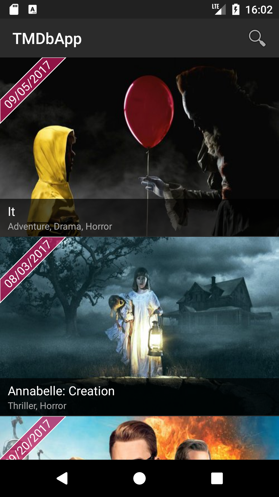
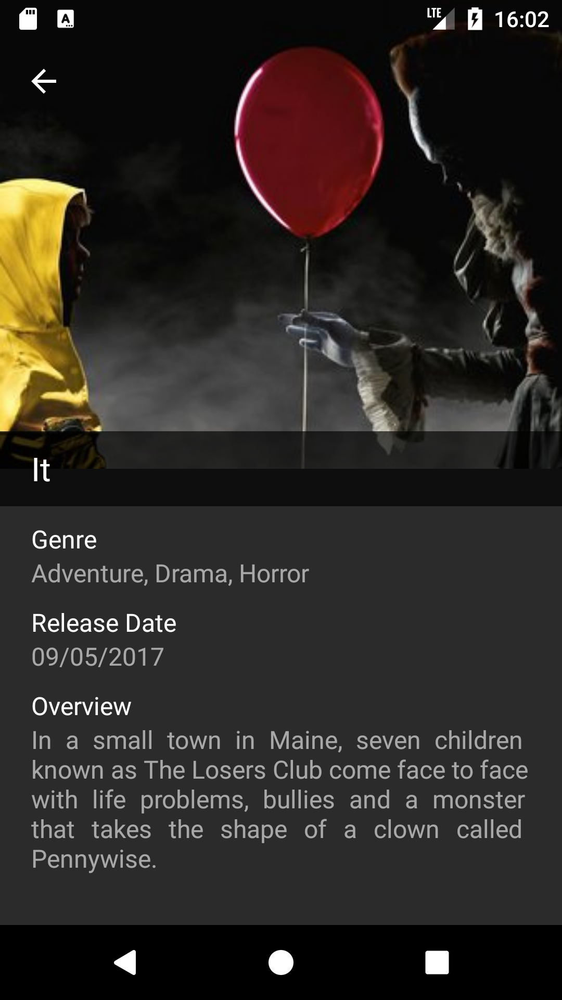
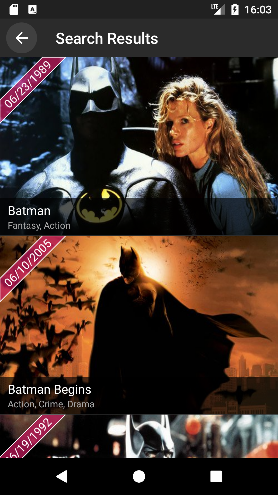

# TMDbApp
A simple Android app that provides easy access to a list of upcoming movies. The app also allow you to search for your favorite movies.

  

## Requisites
* Java 8
* SDK Version 26
* Build Tools 26.0.1
* Supoort Library 26.1.0
* Constraint Layout 1.0.2

## Third LIbraries
* Retrofit, OkHttp, RxJava
  I used these three libraries in my network layer. I think theses libraries together create a easy way to make network calls and to treat the result using reactive programing.

* Dagger 2
I chose Dagger to be my dependency injector because it generate the class in build time that means that doest not affect the performance of the application. It also include custom scope which allow you to recreate the class in case of needed and other features.

* ButterKnife
  I used this library to avoid use findViewById all the time.

* Picasso
  I chose the picasso library to loading the movie image because it is one of the most used library to image loading and also because you do not need to config a lot of things before using it.
   
* Flexible Adapter
    This library offer a easy way to create recycleview items. You do not need create any adapter because it offer a flexible adapter where you can use to do different things such as drag and drop item, swipe left and right and other things with just one adapter. This library also include pull to refresh, infinite loading and more.
    
* LabelView
I used this library to show the release date of the movie. I can not tell much more about this library because was my first time that I am using it.

* Justified TextView
This Library I used to show the overview text justified because the Android doest not support this feature yet.
